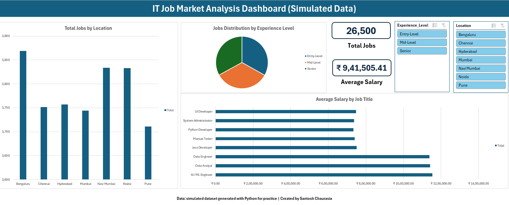

# IT Job Market Analysis (Simulated Data)

This is a practice project where I analysed 26,500 IT job postings from Indian cities. I used Python, SQL (SQL Server), Excel and Power BI.

> **Note:** The data is **simulated (not real)**. I generated it with Python using rules that I wrote myself (like salary ranges for each experience level). So it is **not real hiring data** and the results are not about the real job market. I made this project only to practice the full analysis steps.

---

## Dashboards

**Power BI**


**Excel**



---

## What I Wanted to Do

- Make a dataset of IT jobs (a jobs table and a skills table) and prepare it for SQL.
- Answer questions with SQL: top skills, salary by city, salary tiers, experience vs salary, top companies.
- Explore the data in Python and make a few charts.
- Make a dashboard in Excel and in Power BI.

## Tools Used

| Tool | Used for |
| --- | --- |
| Python (Pandas, Plotly) | Making the data, splitting skills, simple charts |
| SQL Server | 8 queries (JOIN, GROUP BY, CASE, subquery) |
| Excel | Pivot tables, pivot charts, slicers, dashboard |
| Power BI | Dashboard with KPI cards, charts and a slicer |

## Steps I Followed

1. Made 26,500 job rows in Python and saved them as `simulated_it_jobs.csv`.
2. Split the skills so that each skill has its own row (`Normalized_Job_Skills.csv`).
3. Loaded both files in SQL Server and ran 8 queries.
4. Saved a small 4-column file (`IT_Job_Market_Clean.csv`) for Excel, Power BI and the Python charts.
5. Made the Excel and Power BI dashboards.

## Project Structure

```text
IT-Job-Market-Analysis/
├── Data/
│   ├── simulated_it_jobs.csv
│   ├── Normalized_Job_Skills.csv
│   └── IT_Job_Market_Clean.csv
├── Python/
│   ├── Data_Generation_&_Cleaning.ipynb
│   └── IT_Job_Market_Analysis.ipynb
├── SQL/
│   ├── create db.sql
│   ├── Query 1 ... Query 8 (.sql files)
│   └── Query IT_Job_Market_Clean.csv.sql
├── Excel/
│   ├── IT_Job_Market_Workbook.xlsx
│   └── excel_dashboard.png
├── Power BI/
│   ├── IT Job Market Analysis Dashboard.pbix
│   └── powerbi_dashboard.png
├── IT_Job_Market_Project_Documentation.pdf
├── LICENSE
└── README.md
```

## Dataset

`simulated_it_jobs.csv` has 26,500 rows and 8 columns.

| Column | Meaning |
| --- | --- |
| Job_ID | Unique ID (JOB_100000 to JOB_126499) |
| Company_Name | 12 companies (TCS, Infosys, Wipro, Cognizant, etc.) |
| Job_Title | 8 roles (AI / ML Engineer, Data Analyst, Data Engineer, Java Developer, Python Developer, UI Developer, Manual Tester, System Administrator) |
| Skills_Required | Skills for the role, separated by commas |
| Experience_Level | Entry-Level, Mid-Level or Senior |
| Salary_INR | Salary per year in rupees |
| Location | Bengaluru, Navi Mumbai, Mumbai, Pune, Hyderabad, Noida, Chennai |
| Posted_Year | 2024, 2025 or 2026 |

`Normalized_Job_Skills.csv` has 127,180 rows (one row for each job and skill).

**How I made the data:**
- Company, city, experience level and year are picked randomly.
- AI/Data roles (Data Analyst, AI / ML Engineer, Data Engineer) are 30% of jobs in 2024, 50% in 2025 and 70% in 2026.
- Each experience level has a salary range, and AI/Data roles get higher ranges.
- AI/Data salaries get a 15% increase in 2026.
- Every role has a fixed list of skills.

## SQL Queries

All queries are in the `SQL/` folder. They run on the database `IT_Job_Market_DB` (tables `it_jobs_main` and `job_skills_normalized`).

| # | Question | What I used |
| --- | --- | --- |
| 1 | Top 10 skills in demand | GROUP BY, TOP, ORDER BY |
| 2 | Top skills for Data Analyst | JOIN |
| 3 | City-wise average salary for Data Analyst | AVG, GROUP BY |
| 4 | Salary tiers (below 6, 6 to 12, above 12 LPA) | CASE, CAST |
| 5 | Experience level vs average salary | AVG, CAST |
| 6 | Top 10 hiring companies | COUNT, TOP |
| 7 | Top skills for Python Developer | JOIN |
| 8 | Jobs by city with market share % | subquery, ROUND |

## What I Found (in the simulated data)

- There are 26,500 jobs and the average salary is 9.42 LPA (median 8.09 LPA).
- AI/Data roles pay 11.44 LPA on average and other roles pay 7.42 LPA.
- Entry-Level pays 4.14 LPA, Mid-Level 8.48 LPA and Senior 15.68 LPA.
- 35.4% of jobs are below 6 LPA, 36.8% are between 6 and 12 LPA and 27.8% are above 12 LPA.
- The share of AI/Data jobs goes from 30.2% (2024) to 49.5% (2025) to 69.5% (2026).
- Python (15,861) and SQL (14,042) are the top skills.
- For Data Analysts, Mumbai pays the most (11.69 LPA) and Navi Mumbai the least (11.13 LPA). The difference is only about 5%.
- Every city has 14.0% to 14.6% of the jobs, and every company has 2,134 to 2,273 jobs.

## Limitations

- The data is simulated. Most results (like equal jobs in every city) come from the random rules I used, so they are not real insights.
- Every role has a fixed skill list, so the skill queries give ties. For example, every Data Analyst skill appears 4,381 times.
- The dashboards use only the 4-column clean file, so they do not show company, skills or year.
- I did not use a random seed, so running the generator again gives slightly different numbers.
- Salary is one yearly number. There is no bonus or other pay.

## What I Learned

- How to make a dataset with Python and split a column into a separate table.
- How to use JOIN, CASE, subquery and GROUP BY in SQL Server.
- How to make pivot tables, charts and slicers in Excel, and a dashboard in Power BI.
- That results from simulated data mostly show the rules I put in it.

## How to Run

1. **Python:** Open the notebooks in Jupyter or Colab (`pip install pandas plotly`). Running the generator makes a new random dataset, so use the CSV files in `Data/` to get the same numbers as above.
2. **SQL:** Run `create db.sql`, import `simulated_it_jobs.csv` as `it_jobs_main` and `Normalized_Job_Skills.csv` as `job_skills_normalized`, then run the query files.
3. **Excel / Power BI:** Open the files in the `Excel/` and `Power BI/` folders.

## Author

**Santosh Chaurasia**
M.Sc. Data Science student
Email: amsantoshchaurasia@gmail.com

## License

MIT License
