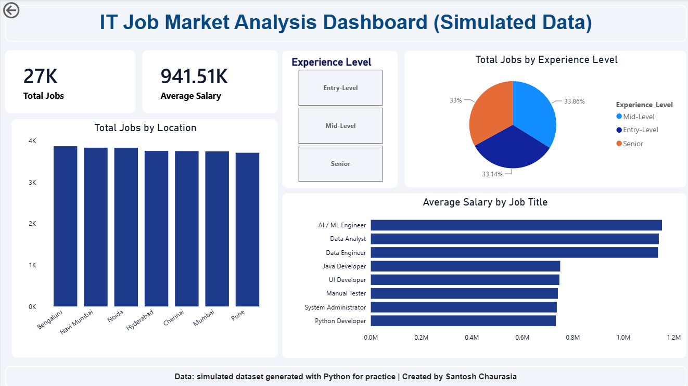

# IT Job Market Analysis

An end-to-end data analytics project on **26,500 simulated IT job postings** from Indian tech hubs, built with **Python, SQL (SQL Server), Excel and Power BI**.

> **Note on the data:** the dataset is **simulated**. It was generated with Python (`random`) using rules I defined myself (role mix by year, salary ranges by experience level, and so on). It is **not real hiring data**. The goal of this project is to demonstrate the full analytics workflow: data generation, normalization, SQL analysis, EDA and dashboarding. The findings below describe the simulated data and are **not** claims about the real job market.

---

## Dashboard Preview



---

## Project Goals

- Build a realistic relational dataset (jobs table + normalized skills table) and prepare it for SQL.
- Answer business questions with SQL: skill demand, salary by city, salary tiers, experience vs pay, top hiring companies.
- Explore the data in Python and visualize salary and location patterns.
- Build an Excel dashboard (pivot tables, charts, slicer) and an interactive Power BI dashboard.

---

## Tech Stack

| Tool | Used for |
|------|----------|
| Python (Pandas, Plotly) | Data generation, skill normalization, EDA |
| SQL Server (T-SQL) | Analytical queries (joins, aggregation, CASE, subquery) |
| Microsoft Excel | Pivot tables, pivot charts, slicer, dashboard sheet |
| Power BI | Interactive dashboard with KPI cards, charts and a slicer |

---

## Workflow

```
Python: generate 26,500 jobs  -->  simulated_it_jobs.csv
        split skills (1 row per skill)  -->  Normalized_Job_Skills.csv
                     |
                     v
SQL Server: it_jobs_main + job_skills_normalized  -->  8 analysis queries
                     |
                     v
IT_Job_Market_Clean.csv (4 columns)  -->  Python EDA | Excel workbook | Power BI dashboard
```

---

## Project Structure

```
IT-Job-Market-Analysis/
├── Data/
│   ├── simulated_it_jobs.csv          # main table, 26,500 rows x 8 columns
│   ├── Normalized_Job_Skills.csv      # 127,180 rows (Job_ID, Skill)
│   └── IT_Job_Market_Clean.csv        # 4-column extract used for Excel / Power BI / EDA
├── Python/
│   ├── Data_Generation_&_Cleaning.ipynb   # data generation, inspection, skill normalization
│   └── IT_Job_Market_Analysis.ipynb       # EDA charts (average salary by title, jobs by city)
├── SQL/
│   ├── create db.sql
│   ├── Query 1 ... Query 8 (analysis queries)
│   └── Query IT_Job_Market_Clean.csv.sql  # extract used to build the clean CSV
├── Excel/
│   └── IT_Job_Market_Workbook.xlsx    # pivot tables + dashboard sheet
├── Power BI/
│   └── IT Job Market Analysis Dashboard.pbix
├── Project Report IT Job Market Analysis.docx
├── dashboard.png
└── README.md
```

---

## Dataset

**`simulated_it_jobs.csv`** (26,500 rows)

| Column | Description |
|--------|-------------|
| Job_ID | Unique ID (JOB_100000 to JOB_126499) |
| Company_Name | 12 companies (TCS, Infosys, Wipro, Cognizant, Accenture, ...) |
| Job_Title | 8 roles: AI / ML Engineer, Data Analyst, Data Engineer, Java Developer, Python Developer, UI Developer, Manual Tester, System Administrator |
| Skills_Required | Comma-separated skills (5 or 4 per role) |
| Experience_Level | Entry-Level, Mid-Level, Senior |
| Salary_INR | Annual salary in INR |
| Location | Bengaluru, Navi Mumbai, Mumbai, Pune, Hyderabad, Noida, Chennai |
| Posted_Year | 2024, 2025, 2026 |

**How the data was generated (assumptions built into the generator):**

- Company, city, experience level and year are picked uniformly at random.
- **Market shift:** the share of AI/Data roles (Data Analyst, AI / ML Engineer, Data Engineer) is set to 30% in 2024, 50% in 2025 and 70% in 2026.
- **Salary bands:** each experience level has a salary range, higher for AI/Data roles than for traditional roles.
- AI/Data roles get a **15% salary uplift in 2026**.
- Each role has a fixed skill set.

**`Normalized_Job_Skills.csv`** has one row per job-skill pair so that skills can be joined and counted in SQL.

---

## SQL Analysis

All queries are in the `SQL/` folder and run against `IT_Job_Market_DB` (tables `it_jobs_main` and `job_skills_normalized`).

| # | Business question | Techniques |
|---|-------------------|-----------|
| 1 | Top 10 skills in demand | `GROUP BY`, `TOP`, `ORDER BY` |
| 2 | Top skills for Data Analyst roles | `JOIN` |
| 3 | City-wise average salary for Data Analysts | `AVG`, `GROUP BY` |
| 4 | Salary tiers (< 6 LPA, 6-12 LPA, > 12 LPA) | `CASE`, `CAST` |
| 5 | Experience level vs average salary | `AVG`, `CAST` |
| 6 | Top 10 hiring companies | `COUNT`, `TOP` |
| 7 | Top skills for Python Developer roles | `JOIN` |
| 8 | Job openings by city with market share % | subquery, `ROUND` |

---

## Key Findings (simulated data)

These results come from the simulated dataset and mostly reflect the rules used to generate it.

| Finding | Result |
|---------|--------|
| Total jobs / average salary | 26,500 jobs, average ₹9.42 LPA (median ₹8.09 LPA) |
| AI/Data roles vs other roles | Average salary ₹11.44 LPA vs ₹7.42 LPA (about 54% higher) |
| Experience vs salary | Entry ₹4.14 LPA, Mid ₹8.48 LPA, Senior ₹15.68 LPA (Senior is about 3.8x Entry) |
| Salary tiers | 35.4% of jobs below 6 LPA, 36.8% between 6-12 LPA, 27.8% above 12 LPA |
| Role mix over time | AI/Data share of postings: 30.2% (2024), 49.5% (2025), 69.5% (2026) |
| Top skills overall | Python (15,861) and SQL (14,042), each appearing in 4 of the 8 role skill sets |
| Highest-paying city for Data Analysts | Mumbai (₹11.69 LPA), only about 5% above the lowest city (Navi Mumbai, ₹11.13 LPA) |
| Location and company spread | Every city has 14.0%-14.6% of jobs; every company has 2,134-2,273 postings |

---

## How to Run

1. **Python:** open the notebooks in Jupyter or Colab (`pip install pandas plotly`). Running the generation notebook creates a new random dataset, so numbers will differ slightly from the CSVs in `Data/`. Use the included CSVs to reproduce the results shown here.
2. **SQL:** run `create db.sql` in SQL Server, import `simulated_it_jobs.csv` as `it_jobs_main` and `Normalized_Job_Skills.csv` as `job_skills_normalized`, then run the query files.
3. **Excel / Power BI:** open the files in the `Excel/` and `Power BI/` folders.

---

## Limitations

- The data is simulated, so uniform distributions (cities, companies, experience levels) are artifacts of random generation, not market insights.
- Each role has a fixed skill set, so skill queries return ties (for example every Data Analyst skill appears 4,381 times).
- The dashboard uses only the 4-column clean table, so it does not show company, skills or year trends.
- Salaries are single annual values with no variable pay, bonus or currency components.

---

## Future Improvements

- Repeat the analysis on real job-posting data (for example Naukri data) and compare it with this simulated baseline.
- Add a year-wise trend page and a skills page to the Power BI dashboard.
- Add a seed to the generator so the dataset is exactly reproducible.
- Build a simple salary prediction model once real data is available.

---

## Author

**Santosh Chaurasia**
M.Sc. Data Science student | Aspiring Data Analyst
Email: amsantoshchaurasia@gmail.com

*Personal portfolio project for learning and demonstration purposes.*
